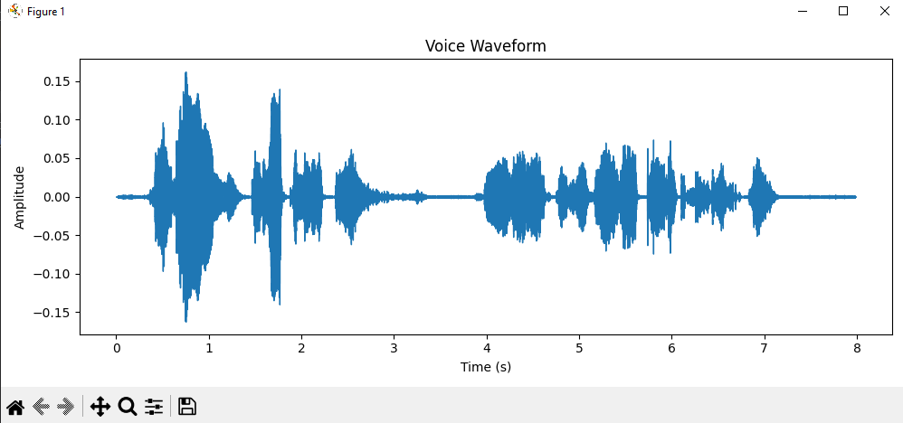
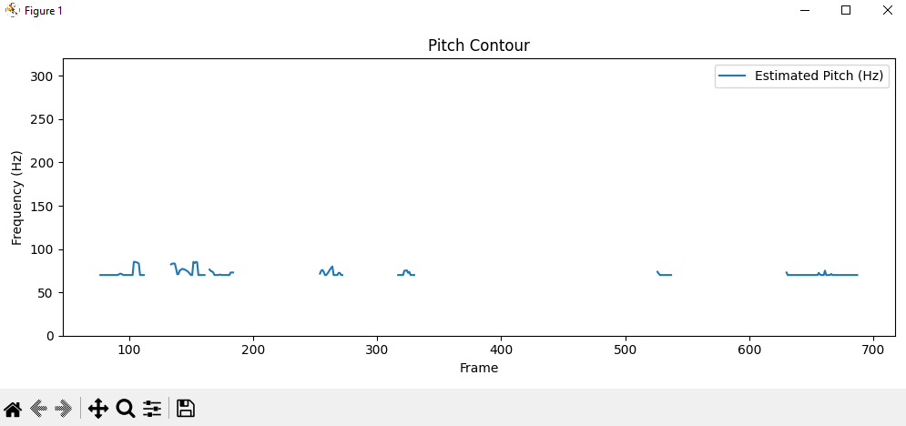
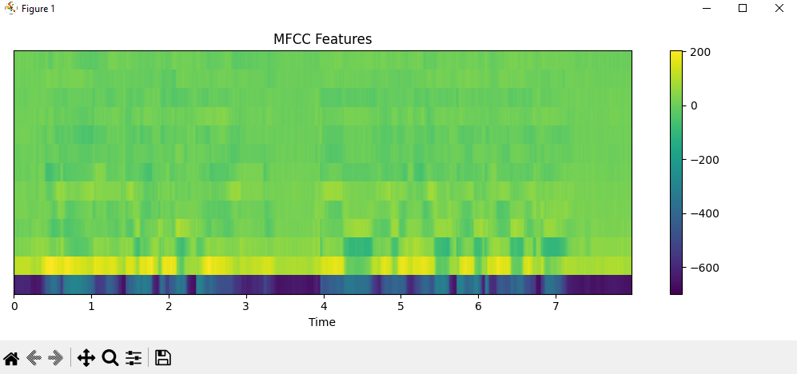

# speech-signal-analysis

This project analyzes recorded speech using Python signal processing techniques.

The program extracts and visualizes important voice features such as:

- waveform visualization
- frequency spectrum analysis
- spectrogram
- pitch detection
- RMS energy analysis
- MFCC feature extraction
- speech timing analysis

Libraries used:

- Librosa
- NumPy
- Matplotlib

This project was developed as part of personal research on voice signal analysis and speech processing.

## Example Analysis Outputs

### Waveform (Amplitude of Human Voice)

### Frequency Spectrum

### Spectrogram

### Pitch Contour

### Speech Energy (RMS)

### MFCC Features

